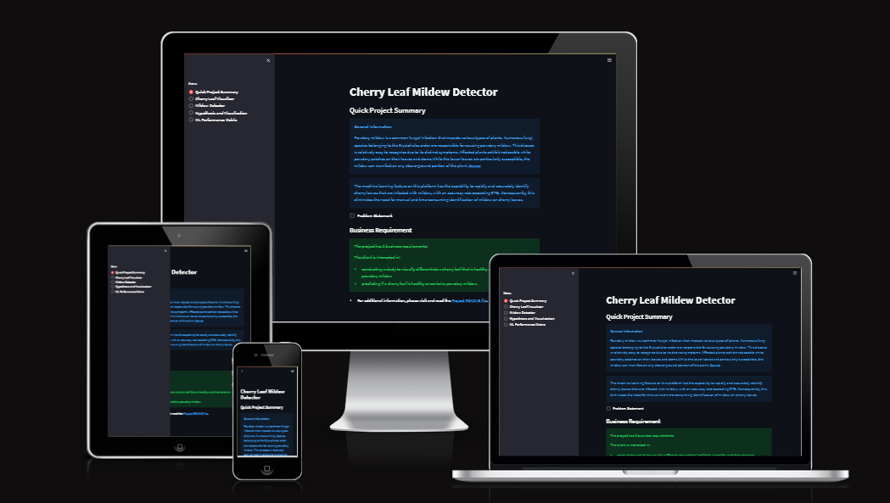
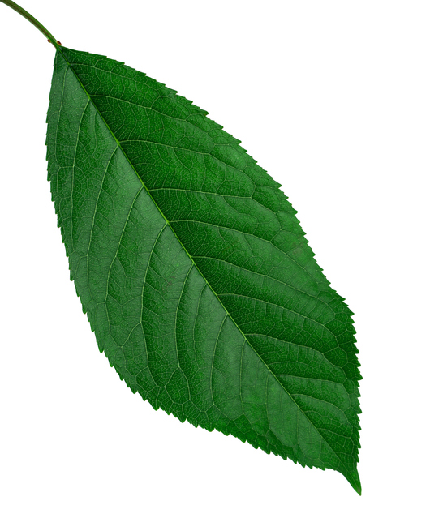
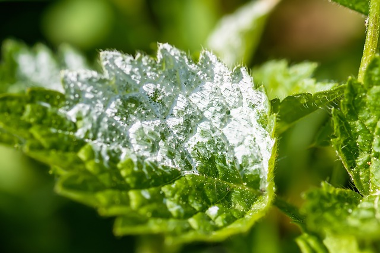
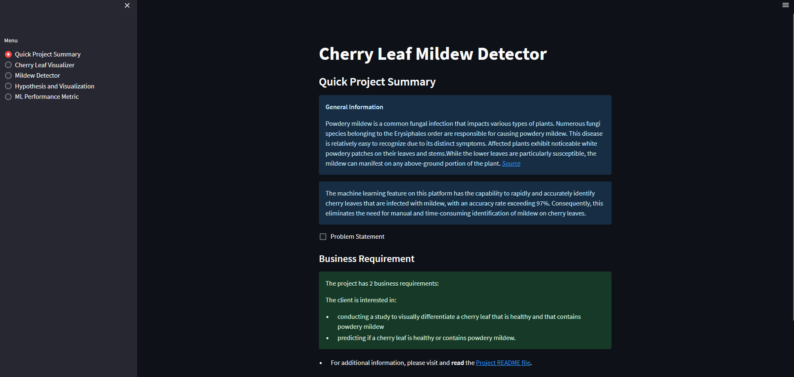
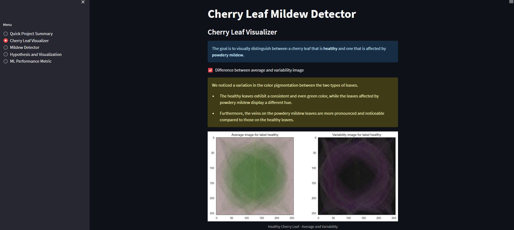
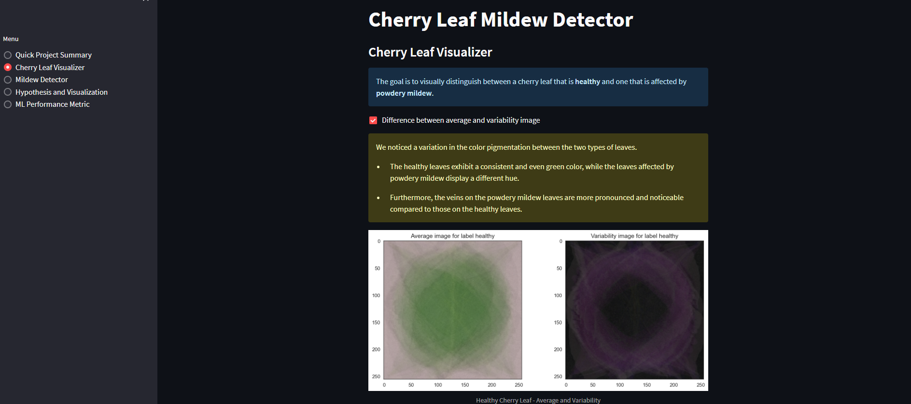
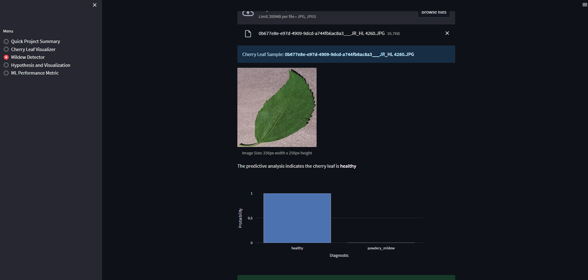
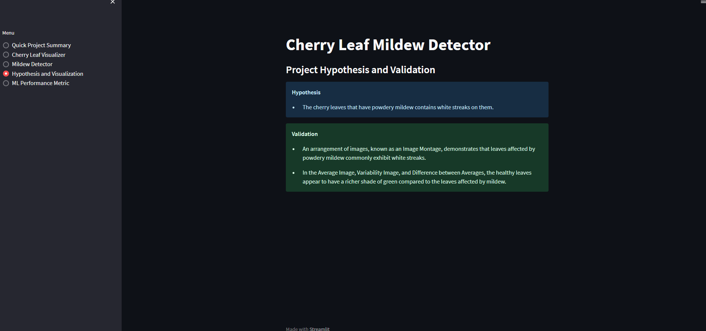
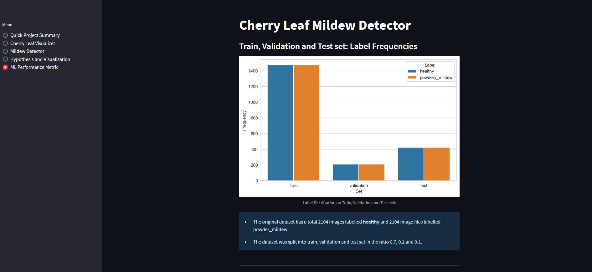

<h1 align=center>Cherry Leaf Mildew Detector</h1>

The machine learning technology provided by this website enables users to upload pictures of cherry leaves and determine if they are in a healthy state or if they have been affected by powdery mildew.

[Live application can be found here](#)

# Planning Phase

## Business Requirements

Farmy & Foods is currently facing a challenge with their cherry plantations, as they have been affected by powdery mildew. To determine if a cherry tree is infected, their current process involves manual verification. An employee dedicates approximately 30 minutes per tree, collecting leaf samples and visually inspecting them for signs of powdery mildew. If the tree is infected, the employee applies a specific compound to eliminate the fungus, taking an additional minute. With numerous cherry trees spread across multiple farms, this manual inspection process is not feasible due to the significant time investment.

To address this issue and save time, the IT team has proposed implementing a machine learning (ML) system that can instantly detect the presence of powdery mildew using images of cherry leaves. If successful, this ML solution could be extended to detect pests in other crops as well, replicating the project across the company. The dataset for training the ML model consists of cherry leaf images provided by Farmy & Foods, captured from their own crops.

### **Project Goal:**

- 1 - The client wishes to perform a research project aimed at visually distinguishing between a healthy cherry leaf and one that is affected by powdery mildew.
- 2 - The client seeks to make predictions regarding the health status of a cherry leaf, specifically whether it is healthy or affected by powdery mildew.

## Dataset Content

- The dataset used for this project was obtained from [Kaggle](https://www.kaggle.com/codeinstitute/cherry-leaves). We then developed a fictional user scenario where predictive analytics can be applied to a practical workplace project.
- The dataset comprises over 4,000 images captured from the client's crop fields. These images depict both healthy cherry leaves and cherry leaves that have been infected with powdery mildew, a fungal disease that affects various plant species. The cherry plantation crop is considered one of the company's top products, and they are concerned about maintaining high-quality standards when supplying the market.

### Sample leaves

---

| healthy                                            | podwery mildew leaf                               |
| -------------------------------------------------- | ------------------------------------------------- |
|  |  |

## Hypothesis and how to validate?

- Tree leaves affected by powdery mildew exhibit visible white streaks on their surface.
  - Traditional data analysis methods will be employed to carry out a research study aimed at visually distinguishing between a healthy cherry leaf and one that is infected with powdery mildew.

## Rationale to map the business requirements to the Data Visualizations and ML tasks

- **Business Requirement 1**: Data Visualization
  In order to visually differentiate healthy and mildew-infested cherry leaves:

  - I desire to showcase images representing the average and variability of healthy cherry leaves and cherry leaves affected by powdery mildew, as a client.
  - As a client, my goal is to exhibit the disparities between a typical, healthy cherry leaf and a cherry leaf afflicted with powdery mildew.
  - In my capacity as a client, I aim to exhibit a collection of images showcasing both a healthy cherry leaf and a leaf affected by mildew.

- **Business Requirement 2**: Classification
  - As a client, my objective is to accurately determine whether a given cherry leaf is in a healthy state or affected by powdery mildew, ensuring that I avoid supplying the market with a compromised quality product.
  - As a client, I desire to create a binary classifier and produce comprehensive reports.

## ML Business Case

- As a client, my objective is to obtain a machine learning model that can accurately predict whether a cherry leaf tree is in a healthy condition or affected by powdery mildew.
- The desired result is to offer Farmy & Foods an efficient and dependable method for detecting mildew, which can be easily scaled across numerous farms throughout the country.
- The model success metric are:
  - A research project demonstrating methods to visually distinguish between a healthy cherry leaf and one that is affected by powdery mildew.
  - The ability to accurately determine whether a cherry leaf is in a healthy state or affected by powdery mildew.The capability to predict if a cherry leaf is healthy or contains powdery mildew.
  - The model accuracy on test data is 0.9988

---

## Data Understanding

The provided dataset consists of labeled images that are organized into two separate folders, representing the respective image labels. For instance, the healthy leaf images are stored in the "healthy" directory, while the mildew-infected leaves are located in the "powder_mildew" directory.

The classification dataset contains a total of 4208 records, with an equal number of instances for each class. Specifically, there are 2104 samples of healthy leaves and 2104 samples of infected leaves, ensuring a balanced dataset.

## Data Preparation

Minimal data cleaning was necessary as the folders were scanned and any non-image files were removed. To ensure effective model training and prevent overfitting, the dataset was divided into three sets: train, test, and validation. The dataset was split with a ratio of 0.7 for the training set, 0.2 for the test set, and 0.1 for the validation set.

Data augmentation techniques were applied to the training dataset using ImageDataGenerator. This process involved generating additional training images by combining various operations, such as random rotation, shifts, shearing, zooming, and flipping, within the computer's temporary memory (RAM). ImageDataGenerator was also utilized to rescale the test and validation datasets.

## Modeling

The training dataset was employed to train the sequential model, which was further validated using the validation dataset.

Subsequently, the trained model was utilized to make predictions on the unseen test dataset, and the accuracy performance metric was computed to evaluate its performance.

## Evaluation

The model achieved an accuracy of over 97% on the test dataset, meeting the desired percentage accuracy. To further assess its performance, two leaves (one healthy and one with mildew, as demonstrated in the provided sample data) that were not included in the dataset were uploaded, and the model accurately predicted their respective conditions.

[Mildew Leaf](docs/images/detector_2.png)

[Healthy Leaf](docs/images/detector_3.png)

---

## Dashboard Design (Streamlit App User Interface)

### Dashboard Wireframe

Dashboard wireframe was created using wireframeCC. The wireframe is in pdf format and can be viewed [here](docs/images/project_wireframe.pdf)

### Page 1: Quick Project Summary

- A project summary page, showing the project dataset summary and the client's requirements.
- Quick project summary

  - General Information
  - Project Dataset

    - The dataset comprises more than four thousand images captured from the client's crop fields. These images depict cherry leaves in two conditions: healthy and affected by powdery mildew, which is a fungal disease that can impact various plants. The cherry plantation crop holds significant value in the client's product portfolio, and ensuring the market receives products of uncompromised quality is a top priority for the company.

  - Business requirements
    - The client seeks to perform a research study aimed at visually distinguishing between a healthy cherry leaf and a cherry leaf affected by powdery mildew.
    - The client has a keen interest in predicting whether a cherry tree is in a healthy state or affected by powdery mildew.

### Page 2: Cherry leaf visualizer

- It will answer business requirement 1
  - This document presents the outcomes obtained from the study focused on visually distinguishing between a healthy cherry leaf and a cherry leaf affected by powdery mildew.
  - Checkbox 1 - Difference between average and variability image
  - Checkbox 2 - Differences between Healthy and Powdery Mildew Cherry Leaves
  - Checkbox 3 - Image Montage

### Page 3: Mildew detector

- It will answer business requirement 2
  - Link to download a set of cherry leaf images for live prediction
  - file upload widget to upload one or more images for prediction
  - Display image and prediction statement indicating whether or not a cherry leaf conatins mildew
  - Display table with image name and prediction result
  - Download button to download table

### Page 4: Project Hypothesis and Validation

- Display each project hypothesis and validation

### Page 5: ML performance metrics

- A technical page displaying the model performance

## **Features**

The application is created utilizing the streamlit library and features a sidebar menu containing five navigation links.

**Navigation**

The developed dashboard is a multi-page streamlit application that incorporates sidebar navigation with checkbox links. These navigation links enable convenient access to the five listed pages:

- **Page 1: Quick Project Summary**
  On this page, you will find a concise summary of the project requirements and an overview of the dataset.
  

- **Page 2: Cherry leaf visualizer**
  This page provides a concise summary outlining the project requirements and an overview of the dataset.
  

- **Page 3: Mildew Detector**
  This provides the interface for the user to upload test samples and predict wether or not the samples provided are healthy or infested with powdery leaf mildew. It features a _Browse file_ button which user can use to upload one or more image files. Prediction is not made until the user clicks on the _Make Prediction_ button. The image uploaded as well as the prediction and report is displayed to the user when the prediction is complete

  

- **Page 4: Hypothesis and Visualization**
  On this page, you will find the project hypothesis and its validation methodology explained throughout the project.
  

- **Page 5: ML Performance Metric**
  This page presents technical details regarding the model and data used. It includes information such as:
- The distribution of labels in the training, validation, and test datasets
- Accuracy and loss charts of the training model
- Overall performance metrics on the test datasets.

---

## Bugs and Fixes

- A------------------------------------------------aaa--------

## Deployment

Steps I took to setup environment and deploy to Heroku

### Workspace Setup

The repository for this project was created off the [template](https://github.com/Code-Institute-Solutions/milestone-project-mildew-detection-in-cherry-leaves) provided by Code Institute and GitPod workspace was used to develop this project.

- Click the `Use This Template` button.
- Add a repository name and brief description.
- Click the `Create Repository from Template` to create your repository.
- Click `Gitpod` to create a Gitpod workspace.
- To return to the current workspace, login to your gitpod acoount and open the workspace created earlier, since clicking on GitPod button on the GitHub page creates a new workpspace each time.

_Cloning the GitHub Repository_

Cloning your repository will enable you to work on a local version of the repository.

1. Locate the [project repository](https://github.com/DenysRudenko/Project5_Mildew-detection-cherry-leaves)
2. Press the arrow on the Code button
3. To clone the repository using HTTPS, copy the [link](git@github.com:DenysRudenko/Project5_Mildew-detection-cherry-leaves.git) that is shown in the drop-down
4. Open Git Bash
5. Change the current working directory to the location where you want the cloned created
6. In the terminal type `git clone` and then paste the link you copied in step 3
   `git clone git@github.com:DenysRudenko/Project5_Mildew-detection-cherry-leaves.git`
7. Press enter and your local clone will be created.

### Creating Heroku App

The Python version in the project is set to 3.8.13, which is not supported by Heroku's current default stack, heroku-22.
As a result of the above, the app was created from Heroku CLI and set to use buildstack heroku-20.

Steps take to create the app is as follows:

1. download and install [Heroku CLI](https://devcenter.heroku.com/articles/heroku-cli) if not already installed
2. Copy API key from heroku
   - sign in and click on the avatar icon and select **Account Settings**
   - Scroll down to the API Key section and click **Reveal** button, and copy key displayed.
3. login to Heroku via the console and enter your details when prompted
   `heroku login -i`
   - enter key copied from step 2 when prompted for password
4. create the app
   `heroku apps:create pp5-mildew-detection --stack heroku-20`

### Deploying to Heroku

1. Sign in to Heroku
2. Select app
3. At the Deploy tab, select GitHub as the deployment method.
4. Select your repository name and click Search. Once it is found, click Connect.
5. Select the branch you want to deploy, then click Deploy Branch.
6. The deployment process should happen smoothly in case all deployment files are fully functional. Click now the button Open App on the top of the page to access your App.

## Technologies Used

### Main Data Analysis and Machine Learning Libraries

- [TensorFlow](https://www.tensorflow.org/overview) - used during image preprocessing to filter out corrupt images.
- [Keras](https://keras.io/) - used for the CNN model
- [joblib](https://pypi.org/project/joblib/) for saving and loading image shape
- [numpy](https://numpy.org/) - used for array manipulation.
- [pandas](https://pandas.pydata.org/) - used to structure the data
- [matplotlib](https://matplotlib.org/) For creating the charts and plots for data visaulization
- [seaborn](https://seaborn.pydata.org/) Used in conjuction with matplotplib for data visualization
- [plotly](https://plotly.com/) - used for ploting charts for data visualization
- [streamlit](https://streamlit.io/) For the dashboard development
- [scikit-learn](https://scikit-learn.org/stable/) - used for data processing
- [jupyter notebook](https://jupyter.org) - used for writing and running the ML pipelines

### OtherFrameworks, Libraries & Programs Used

- [Git](https://git-scm.com/) - used for version control by utilizing the Gitpod terminal to commit to Git and Push to GitHub.
- [GitHub:](https://github.com/) - used to store the projects code after being pushed from Git.
- [Heroku](https://www.heroku.com/) - Deployment platform for the project
- [GitPod](https://www.gitpod.io/) - Workspace used for the project
- [AmIResponsive](http://ami.responsivedesign.is/) - Used to generate responsive image used in README file.

## Credits

During the process of building this website, I relied on various online sources to address issues and overcome challenges. Additionally, I incorporated modules to enhance the website's functionality.

### Content

- The codes used to implement the functionalities in the project are from the Code Institute training by GyanShashwat1611 at [Github site](https://github.com/GyanShashwat1611/WalkthroughProject01/)
- Dataset is from [Kaggle](https://www.kaggle.com/codeinstitute/cherry-leaves)

## Acknowledgements

- I would like to express my gratitude to my mentor, Marcel Mulders, for the valuable support, guidance, and feedback provided during the project.
